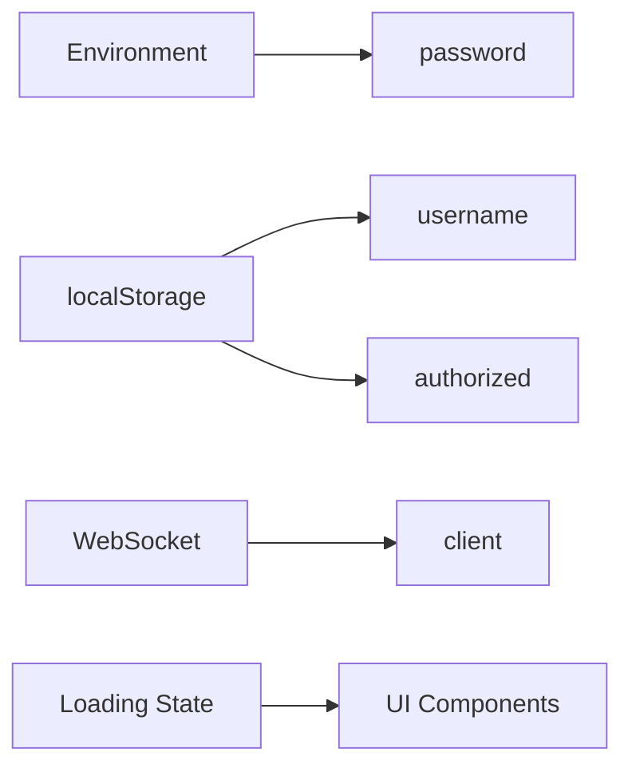
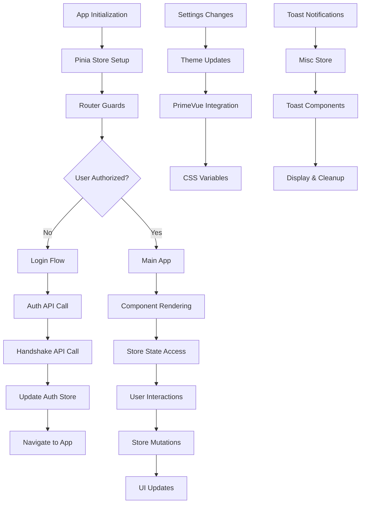
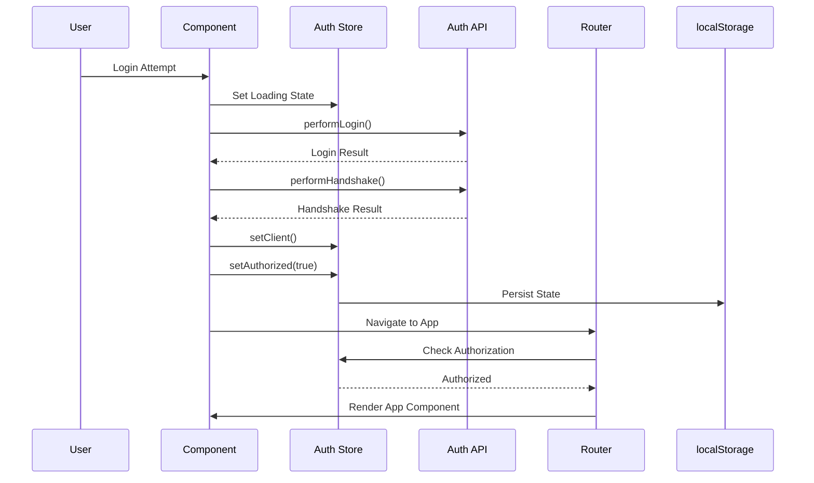

# Vue 3 State Management and Routing Architecture Analysis

## Executive Summary

This document provides a comprehensive analysis of the Vue 3 client application's state management and routing architecture. The application uses Pinia for state management and Vue Router for client-side routing, with sophisticated patterns for authentication, theme management, and notification handling.

## Table of Contents

1. [Pinia Store Structure](#pinia-store-structure)
2. [Vue Router Configuration](#vue-router-configuration)
3. [State Flow Diagrams](#state-flow-diagrams)
4. [Authentication Flow](#authentication-flow)
5. [Error Handling and Asynchronous Patterns](#error-handling-and-asynchronous-patterns)
6. [State Persistence Patterns](#state-persistence-patterns)
7. [Component-Store Communication](#component-store-communication)
8. [Best Practices and Recommendations](#best-practices-and-recommendations)

## Pinia Store Structure

### 1. Authentication Store (`auth.store.ts`)

**Purpose**: Manages user authentication state and client identity.

**State Structure**:
```typescript
interface AuthState {
  username: string;           // Persisted via localStorage
  password: string;           // Populated from environment variable
  loading: boolean;           // Loading state for UI
  authorized: boolean;        // Persisted via localStorage
  client: WebsocketEntityData | null; // Current client data
}
```

**Key Features**:
- **Persistence**: Uses `useLocalStorage` for `username` and `authorized` state
- **Security**: Password sourced from environment variable (`VITE_API_KEY`)
- **Computed Properties**: `authorized` and `client` as computed refs
- **Actions**: `setAuthorized()`, `setClient()`
- **HMR Support**: Hot Module Replacement for development

**State Flow**:


### 2. Miscellaneous Store (`misc.store.ts`)

**Purpose**: Manages application-wide UI state, primarily toast notifications.

**State Structure**:
```typescript
interface MiscState {
  toasts: ToastMessage[];
}

interface ToastMessage {
  msg: string;
  title?: string;
  duration?: number;
  severity?: "error" | "secondary" | "info" | "success" | "warn" | "contrast";
  position?: ToastPosition;
}
```

**Key Features**:
- **Reactive Toast Queue**: Array of toast messages consumed by UI components
- **Flexible Positioning**: 7 different toast positions supported
- **Severity Levels**: 6 different severity types for visual distinction
- **No Persistence**: Transient state only

### 3. Settings Store (`settings.store.ts`)

**Purpose**: Manages application theme and UI preferences.

**State Structure**:
```typescript
interface SettingsState {
  visible: boolean;           // Settings panel visibility
  darkMode: boolean;          // Dark mode preference (persisted)
  currentTheme: CurrentThemeData; // Current theme data (persisted)
}

interface CurrentThemeData {
  group: string | undefined;
  name: string | undefined;
  variable: string | undefined;
  value: string | undefined;
}
```

**Key Features**:
- **Full Persistence**: All settings persisted via `pinia-plugin-persistedstate`
- **Theme Integration**: Direct integration with PrimeVue theme system
- **Reactive Dark Mode**: Automatic DOM class toggling via watchers
- **24 Color Presets**: Comprehensive color palette support

**Theme Management Flow**:
```mermaid
graph TD
    A[Color Selection] --> B[setTheme()]
    B --> C[Update currentTheme]
    C --> D[updatePrimaryPalette()]
    D --> E[PrimeVue Theme System]
    F[Dark Mode Toggle] --> G[setDarkMode()]
    G --> H[DOM Class Toggle]
    H --> I[CSS Variables Update]
```

## Vue Router Configuration

### Route Structure

The application uses a simple but effective routing structure:

```typescript
const routes = [
  {
    path: "/",
    redirect: { name: "login" },
    children: [
      { path: "login", name: "login", component: () => import("../views/Login.vue") },
      { path: "app", name: "app", component: () => import("../views/Dictionary.vue") },
      { path: "match", name: "match", component: () => import("../views/Match.vue") },
    ],
  },
  {
    path: "/:pathMatch(.*)*",
    redirect: { name: "login" },
  },
];
```

### Navigation Guards

**Authentication Guard**:
```typescript
function checkIsAuthorized(to: RouteLocationNormalizedGeneric, next: NavigationGuardNext) {
  const authStore = useAuthStore();
  const isAuthorized = authStore.authorized;
  
  if (to.name === "login" && isAuthorized) {
    next({ name: "app" });
  } else if (to.name !== "login" && !isAuthorized) {
    authStore.loading = true;
    next({ name: "login" });
    setTimeout(() => {
      authStore.loading = false;
    }, 1000);
  } else {
    authStore.loading = false;
    next();
  }
}
```

**Key Features**:
- **Centralized Authentication**: Single guard for all routes
- **Loading State Management**: Automatic loading state handling
- **Fallback Routing**: 404 handling with redirect to login
- **Lazy Loading**: All route components are lazy-loaded

## State Flow Diagrams

### Complete Application State Flow



### Authentication State Flow



## Authentication Flow

### Login Process

1. **User Input**: Username/password entered in LoginForm.vue
2. **Auth Store Update**: Credentials stored in auth store
3. **API Calls**: 
   - `performLogin()` - Validates credentials
   - `performHandshake()` - Establishes API connection
4. **State Persistence**: Authorization state saved to localStorage
5. **Navigation**: Router redirects to main application
6. **WebSocket Setup**: Client data stored for real-time features

### Logout Process

1. **User Action**: Logout button clicked in Settings.vue
2. **State Cleanup**: 
   - localStorage cleared
   - Auth store reset
   - Password and username cleared
3. **Navigation**: Router redirects to login page
4. **Session Reset**: All temporary state cleared

### Route Protection

- **Global Guard**: `router.beforeEach()` checks authentication
- **Automatic Redirects**: Unauthorized users sent to login
- **Loading States**: Managed during navigation transitions

## Error Handling and Asynchronous Patterns

### Error Handling Strategy

1. **Try-Catch Blocks**: Used in authentication composables
2. **Toast Notifications**: Errors displayed via toast system
3. **State Rollback**: Failed operations reset store state
4. **Graceful Degradation**: Loading states provide user feedback

### Asynchronous Patterns

```typescript
// Authentication composable pattern
async function login(credentials: { username: string; password: string }) {
  try {
    loading.value = true;
    const res = await performLogin(credentials.username, credentials.password);
    if (!res.authorized) throw new Error("Login failed");
    
    const handshakeRes = await performHandshake(username.value, password.value, api_key_val);
    if (!handshakeRes.status) throw new Error("Handshake failed");
    
    store.setClient(handshakeRes.data);
    store.setAuthorized(true);
    
    router.push("/app");
  } catch (e) {
    loading.value = false;
    store.setAuthorized(false);
    utils.toast.error("Failed to login or connect to chat");
  }
}
```

## State Persistence Patterns

### LocalStorage Integration

1. **Auth Store**: `username` and `authorized` state persisted
2. **Settings Store**: Complete store state persisted via plugin
3. **Misc Store**: No persistence (transient notifications)

### Persistence Configuration

```typescript
// Via VueUse composable
const username = useLocalStorage("username", "");
const _authorized = useLocalStorage("authorized", false);

// Via Pinia plugin
export const useSettingsStore = defineStore("settingsStore", () => {
  // ... store implementation
}, { persist: true });
```

### Cache Management

- **Version-Based Invalidation**: App version changes trigger cache clear
- **Selective Persistence**: Only critical state persisted
- **Security Considerations**: Sensitive data not persisted

## Component-Store Communication

### Access Patterns

1. **Direct Store Access**: Components import and use stores directly
2. **Composable Wrapper**: `useAuth()` composable provides abstraction
3. **Reactive Updates**: Vue's reactivity system handles updates

### Data Flow Examples

```typescript
// Component accessing store directly
const store = useSettingsStore();
const visible = computed(() => store.visible);

// Component using composable wrapper
const auth = useAuth();
const { authorized, username, loading } = auth;

// Component triggering store mutations
function logout() {
  auth.logout();
  router.push({ name: "login" });
}
```

### Communication Patterns

1. **Props Down**: Parent components pass store data as props
2. **Events Up**: Child components emit events to trigger store mutations
3. **Global State**: Shared state accessible across component tree
4. **Computed Properties**: Reactive derivations of store state

## Best Practices and Recommendations

### Current Strengths

1. **Separation of Concerns**: Clear separation between stores
2. **Type Safety**: Full TypeScript integration
3. **Reactivity**: Proper use of Vue's reactivity system
4. **Performance**: Lazy loading and efficient state updates
5. **Developer Experience**: HMR support and clear naming

### Areas for Improvement

1. **Error Boundaries**: Consider implementing error boundaries
2. **Loading States**: Standardize loading state management
3. **Store Composition**: Consider store composition for complex state
4. **Testing**: Add unit tests for store logic
5. **Documentation**: Inline JSDoc comments for better IDE support

### Security Considerations

1. **Sensitive Data**: Password cleared on logout
2. **Environment Variables**: API keys from environment
3. **State Validation**: Client-side validation with server verification
4. **Session Management**: Proper session cleanup

## Dependencies and Architecture

### Key Dependencies

- **Pinia**: `^2.3.1` - State management
- **Vue Router**: `^4.5.0` - Client-side routing
- **VueUse**: `^11.3.0` - Composable utilities
- **PrimeVue**: `^4.3.2` - UI component library
- **Pinia Plugin Persistedstate**: `^4.2.0` - State persistence

### Architecture Summary

The application follows a modern Vue 3 architecture with:

- **Composition API**: Used throughout for better code organization
- **TypeScript**: Full type safety and IDE support
- **Modular Design**: Clear separation of concerns
- **Reactive State**: Efficient state management with Pinia
- **Persistent State**: Critical state persisted across sessions

This architecture provides a solid foundation for a real-time chat application with proper authentication, theme management, and user experience considerations.

---

*Analysis completed by Batman - Task 2.2: State Management and Routing Analysis*