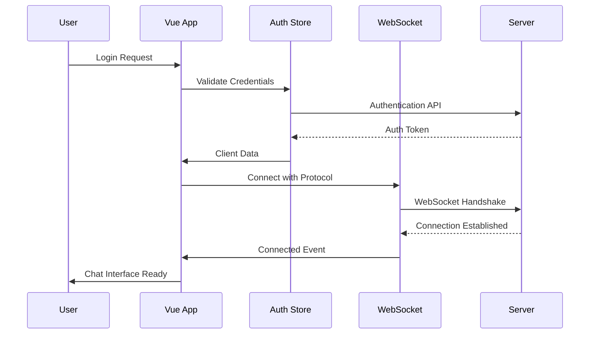
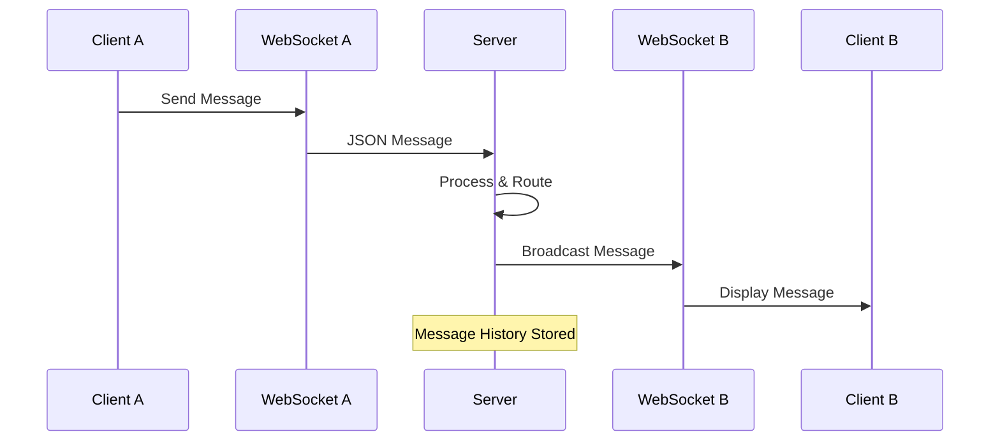
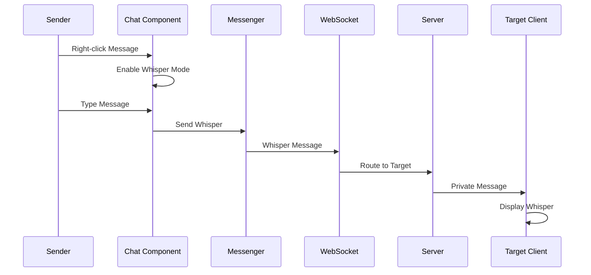
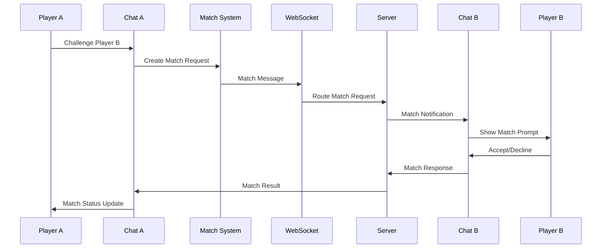

# WebSocket Architecture Analysis - Vue 3 Client Application

## Executive Summary

The Rune RPG client application implements a comprehensive WebSocket architecture for real-time communication, featuring a chat system, matchmaking integration, and robust connection management. The implementation follows a modular pattern with Vue 3 composables, VueUse WebSocket integration, and TypeScript for type safety.

## Table of Contents

1. [WebSocket Architecture Overview](#websocket-architecture-overview)
2. [Composables Analysis](#composables-analysis)
3. [Component Architecture](#component-architecture)
4. [Message Types and Protocol](#message-types-and-protocol)
5. [Authentication and Security](#authentication-and-security)
6. [Connection Management](#connection-management)
7. [Error Handling and Reconnection](#error-handling-and-reconnection)
8. [Real-time Features](#real-time-features)
9. [Sequence Diagrams](#sequence-diagrams)
10. [Server-Side Integration](#server-side-integration)
11. [Performance Considerations](#performance-considerations)
12. [Recommendations](#recommendations)

---

## WebSocket Architecture Overview

### Core Architecture Pattern

The WebSocket implementation follows a **layered architecture**:

```
┌─────────────────────────────────┐
│        Vue Components           │
│  (Chat, WebsocketConnection)    │
├─────────────────────────────────┤
│        Composables Layer        │
│  (Business Logic & Interface)   │
├─────────────────────────────────┤
│        VueUse WebSocket         │
│    (Connection Management)      │
├─────────────────────────────────┤
│        Native WebSocket API     │
│    (Browser Implementation)     │
└─────────────────────────────────┘
```

### Key Technologies

- **Vue 3 Composition API**: Reactive state management
- **VueUse WebSocket**: Connection abstraction and utilities
- **TypeScript**: Type safety and IntelliSense
- **Pinia**: State management for authentication and settings
- **PrimeVue**: UI components for chat interface
- **Topsyde-Utils**: Shared utilities and type definitions

---

## Composables Analysis

### 1. `useWebsocketInterface.ts` - WebSocket Client Interface

**Purpose**: Provides WebSocket connection configuration and event handlers

**Key Features**:
- **Connection Configuration**: Host, heartbeat, auto-reconnect settings
- **Event Handling**: Message processing, connection state management
- **Protocol Support**: Custom protocol for client identification
- **Error Management**: Connection failures and recovery

```typescript
// Configuration
const WEBSOCKET_HOST = import.meta.env.VITE_WS_HOST || "wss://topsyde-gaming.duckdns.org:3000";
const PING_PONG_INTERVAL = 20; // seconds

// Heartbeat Configuration
const heartbeatOptions: Ref<Heartbeat> = ref({
    interval: PING_PONG_INTERVAL * 1000,
    pongTimeout: PING_PONG_INTERVAL * 1000,
    message: "ping",
});

// Auto-reconnect Configuration
const autoReconnectOptions: Ref<AutoReconnect> = ref({
    retries: 1,
    delay: 1000,
    onFailed: handleReconnectFailed,
});
```

**Message Processing Flow**:
1. Receive raw WebSocket message
2. Parse JSON to `WebsocketStructuredMessage`
3. Create WSM instance with `useWSM`
4. Route to message handler or action handler
5. Update UI state or trigger business logic

### 2. `useWebsocketLogic.ts` - WebSocket Business Logic

**Purpose**: Handles WebSocket message routing and business logic

**Message Types Handled**:
- **SYSTEM**: System notifications and status updates
- **ERROR**: Error messages and alerts
- **MATCH**: Match requests and matchmaking actions

```typescript
function process(wsm$: I_UseWSM) {
    if (wsm$.is(E_WebsocketMessageType.SYSTEM)) {
        console.log(wsm$.data);
    }
    
    if (wsm$.is(E_WebsocketMessageType.ERROR)) {
        console.log(wsm$.data);
    }
    
    if (wsm$.is("match")) match$.onMatchRequest(wsm$);
}
```

### 3. `useWSM.ts` - WebSocket Message Parser

**Purpose**: Parses and provides typed access to WebSocket messages

**Key Computed Properties**:
- `isMessage`: Standard chat messages
- `isWhisper`: Private messages
- `isBroadcast`: Public broadcast messages
- `isPrompt`: User prompts and dialogs
- `isSystemMessage`: System-generated messages
- `isErrorMessage`: Error notifications
- `isHeartbeat`: Ping/pong messages

```typescript
const isMessage = computed(() => 
    type.value === E_WebsocketMessageType.MESSAGE || 
    type.value === E_WebsocketMessageType.WHISPER || 
    type.value === E_WebsocketMessageType.BROADCAST
);

const sender = computed(() => {
    if (!isGenericMessage.value) {
        return client.value?.name || client.value?.id || "System";
    }
    return "System";
});
```

### 4. `useMessenger.ts` - Message Sending Interface

**Purpose**: Handles outgoing message construction and transmission

**Message Types Supported**:
- **MESSAGE**: Regular chat messages
- **WHISPER**: Private messages to specific users
- **BROADCAST**: Public messages to all users

```typescript
function sendMessage(client: MessagesEntity, input: string, options?: I_SendMessageOptions) {
    const message: WebsocketStructuredMessage = {
        type: options?.type || E_WebsocketMessageType.MESSAGE,
        content: { message: input },
        channel: options?.channel || "global",
        timestamp: new Date().toISOString(),
        client: client,
        metadata: options?.metadata,
    };
    
    send(JSON.stringify(message));
}
```

---

## Component Architecture

### 1. `WebsocketConnection.vue` - Main WebSocket Component

**Purpose**: Top-level WebSocket connection manager and authentication gate

**Key Features**:
- **Authentication Integration**: Checks user authorization
- **Connection State Management**: Loading states and error handling
- **Client Validation**: Ensures valid client data before connection
- **Graceful Degradation**: Handles connection failures

```vue
<template>
    <div class="websocket-connection-interface">
        <template v-if="isChatReady">
            <div v-if="auth$.loading.value" class="loading-container">
                <div class="loading-spinner"></div>
                <p>Connecting to chat server...</p>
            </div>
            <Chat v-else-if="auth$.client.value" 
                  :client="auth$.client.value!" 
                  @logout="auth$.logout()" />
        </template>
        <div v-else-if="errorMessage" class="chat-error-message">
            {{ errorMessage }}
        </div>
    </div>
</template>
```

### 2. `Chat.vue` - Core Chat Interface

**Purpose**: Main chat functionality with messaging and real-time features

**Key Features**:
- **Message Display**: Scrollable message history
- **Input Handling**: Message composition and sending
- **Whisper Mode**: Private messaging functionality
- **Status Indicators**: Connection state visualization
- **Macro Commands**: Chat shortcuts (e.g., `/s` to clear whisper)

**Chat Modes**:
- **Broadcast Mode**: Default public chat
- **Whisper Mode**: Private messaging with target selection

```typescript
// Message sending logic
function sendMessage(msg?: string) {
    messenger.sendMessage(
        props.client, 
        msg || inputMessage.value, 
        { 
            type: whisperMode.value ? E_WebsocketMessageType.WHISPER : E_WebsocketMessageType.BROADCAST, 
            target: targetEntity.value 
        }
    );
    inputMessage.value = "";
}

// Whisper mode activation
function handleWhisper(entity: WebsocketEntityData) {
    mode.value = "whisper";
    setTargetEntity(entity);
    nextTick(() => {
        (inputRef.value as any).$el.focus();
    });
}
```

### 3. `ChatWindow.vue` - Draggable Chat Window

**Purpose**: Provides resizable and draggable chat interface

**Key Features**:
- **Drag and Drop**: Window positioning
- **Resize Handles**: Bottom-right and top-right resize
- **Boundary Constraints**: Keeps window within container
- **Mobile Responsive**: Adapts to mobile viewport
- **Persistent State**: Saves position and size to localStorage

```typescript
// Mobile detection and positioning
const isMobile = computed(() => window.innerWidth <= 1024);

// Boundary enforcement
function ensureWithinBounds() {
    const maxX = bounds.left + bounds.width - windowRect.width;
    const maxY = bounds.top + bounds.height - windowRect.height;
    
    position.value = {
        x: Math.max(bounds.left, Math.min(maxX, position.value.x)),
        y: Math.max(bounds.top, Math.min(maxY, position.value.y)),
    };
}
```

### 4. `ChatMessage.vue` - Individual Message Component

**Purpose**: Renders individual chat messages with actions

**Key Features**:
- **Message Formatting**: Timestamp, sender, content display
- **Context Menu**: Right-click actions (whisper, match)
- **Message Types**: Different styling for system, error, whisper messages
- **Action Handling**: Triggers parent component actions

```vue
<template>
    <div class="message" @contextmenu="onContextMenu" @click="onContextMenu">
        <span class="message-information">
            [{{ formattedTime }} - 
            <span class="channel" :class="{ 'whisper-indicator': isWhisper }">
                {{ channel }}]
            </span>
        </span>
        <span class="sender" :class="{ 'system-indicator': isSystemMessage }">
            {{ sender }}:
        </span>
        <span class="message-content">{{ content.message }}</span>
    </div>
</template>
```

---

## Message Types and Protocol

### WebSocket Message Structure

All messages follow the `WebsocketStructuredMessage` interface:

```typescript
interface WebsocketStructuredMessage<T = Record<string, any>> {
    type: string;                    // Message type identifier
    content: T;                      // Message payload
    channel?: string;                // Channel identifier
    timestamp?: string;              // ISO timestamp
    client?: WebsocketEntityData;    // Sender information
    metadata?: Record<string, any>;  // Additional metadata
    [key: string]: any;             // Custom fields
}
```

### Message Types (E_WebsocketMessageType)

```typescript
enum E_WebsocketMessageType {
    CLIENT_CONNECTED = "client.connected",
    CLIENT_DISCONNECTED = "client.disconnected",
    CLIENT_JOIN_CHANNEL = "client.join.channel",
    CLIENT_LEAVE_CHANNEL = "client.leave.channel",
    CLIENT_JOIN_CHANNELS = "client.join.channels",
    CLIENT_LEAVE_CHANNELS = "client.leave.channels",
    PING = "ping",
    PONG = "pong",
    MESSAGE = "message",
    WHISPER = "whisper",
    BROADCAST = "broadcast",
    PROMPT = "prompt",
    ERROR = "error",
    SYSTEM = "system"
}
```

### Channel System

- **global**: Main public chat channel
- **whisper**: Private messaging channel
- **match**: Matchmaking and game-related messages
- **system**: System notifications and status updates

### Client Entity Structure

```typescript
interface WebsocketEntityData {
    id: string;      // Unique client identifier
    name: string;    // Display name
}
```

---

## Authentication and Security

### Authentication Flow

1. **User Login**: Credentials validated through auth API
2. **Handshake**: Secondary validation with API key
3. **Client Creation**: Generate WebSocket client entity
4. **Protocol Assignment**: Client ID and name in WebSocket protocol header

```typescript
// Authentication process
async function login(credentials: { username: string; password: string }) {
    loading.value = true;
    
    // Step 1: Login validation
    const res = await performLogin(credentials.username, credentials.password);
    if (!res.authorized) throw new Error("Login failed");
    
    // Step 2: API handshake
    const handshakeRes = await performHandshake(username.value, password.value, api_key_val);
    if (!handshakeRes.status) throw new Error("Handshake failed");
    
    // Step 3: Set client state
    store.setClient({
        id: handshakeRes.data.id,
        name: handshakeRes.data.name,
    });
    
    store.setAuthorized(true);
}
```

### Security Measures

- **API Key Validation**: Server-side API key verification
- **Dual Authentication**: Login + handshake verification
- **Client Protocol**: Secure client identification via WebSocket protocol
- **State Management**: Secure state storage and cleanup on logout

---

## Connection Management

### Connection Lifecycle

1. **Initialization**: WebSocket connection establishment
2. **Authentication**: Protocol-based client identification
3. **Channel Assignment**: Automatic channel joining
4. **Message Handling**: Real-time message processing
5. **Disconnection**: Graceful cleanup and state management

### Heartbeat System

```typescript
// Heartbeat configuration
const heartbeatOptions: Ref<Heartbeat> = ref({
    interval: 20000,        // 20 seconds
    pongTimeout: 20000,     // 20 seconds timeout
    message: "ping",        // Ping message
});
```

### Auto-Reconnection

```typescript
// Auto-reconnect configuration
const autoReconnectOptions: Ref<AutoReconnect> = ref({
    retries: 1,            // Single retry attempt
    delay: 1000,           // 1 second delay
    onFailed: handleReconnectFailed,
});
```

---

## Error Handling and Reconnection

### Connection States

- **CONNECTING**: Initial connection establishment
- **OPEN**: Active connection with message flow
- **CLOSED**: Disconnected state
- **ERROR**: Connection error state

### Error Handling Strategy

1. **Connection Failures**: Auto-reconnect with exponential backoff
2. **Message Parsing Errors**: Graceful error logging and recovery
3. **Authentication Failures**: Redirect to login with error message
4. **Network Issues**: User notification and retry mechanisms

```typescript
function handleError(ws: WebSocket, event: Event) {
    Lib.Warn(`WebSocket error:`, event);
    messages.value.push({
        type: "error",
        content: { message: "Error with chat connection" },
        timestamp: new Date().toISOString(),
    });
}

function handleReconnectFailed() {
    messages.value.push({
        type: "error",
        content: { message: "Failed to reconnect after multiple attempts" },
        timestamp: new Date().toISOString(),
    });
}
```

---

## Real-time Features

### 1. Chat System

**Features**:
- **Real-time Messaging**: Instant message delivery
- **Message History**: Persistent chat history
- **Message Types**: Support for different message formats
- **User Presence**: Online/offline status indicators

**Message Flow**:
```
User Input → Messenger → WebSocket → Server → Broadcast → All Clients → UI Update
```

### 2. Private Messaging (Whisper)

**Features**:
- **Target Selection**: Click-to-whisper functionality
- **Visual Indicators**: Whisper mode highlighting
- **Message Routing**: Server-side private message delivery
- **Context Menu**: Right-click whisper initiation

```typescript
// Whisper message structure
const whisperMessage: WebsocketStructuredMessage = {
    type: E_WebsocketMessageType.WHISPER,
    content: { message: inputMessage, target: target },
    channel: "global",
    timestamp: new Date().toISOString(),
    client: client,
};
```

### 3. Match System Integration

**Features**:
- **Match Requests**: Real-time match invitations
- **Prompt System**: Interactive match acceptance/decline
- **Status Updates**: Match progress notifications
- **Challenge System**: Player-to-player challenges

```typescript
// Match request handling
function onMatchRequest(wsm$: I_UseWSM) {
    prompt$.next({
        message: MATCH_MESSAGE,
        from: wsm$.client.value,
        time: 10,
        metadata: wsm$.data,
        callback: (choice: PromptChoice, data: PromptData) => {
            console.log(choice, data.metadata);
        },
    });
}
```

### 4. System Notifications

**Features**:
- **Connection Status**: Join/leave notifications
- **System Messages**: Server announcements
- **Error Notifications**: Connection and system errors
- **Presence Updates**: User status changes

---

## Sequence Diagrams

### WebSocket Connection Establishment



### Message Exchange Flow



### Whisper Message Flow



### Match Request Flow



---

## Server-Side Integration

### WebSocket Service Architecture

```typescript
// Server-side WebSocket service
export default class WebsocketService implements I_WebsocketInterface {
    private actions: I_WebsocketActions;
    private channels: WebsocketChannel;
    private ms: MessagesService;
    
    constructor() {
        this.actions = {
            broadcast: this.ms.broadcast.bind(this.ms),
            message: this.ms.message.bind(this.ms),
            whisper: this.ms.whisper.bind(this.ms),
        };
    }
}
```

### Message Services

1. **MessagesService**: Core message handling and routing
2. **MessageHistoryService**: Message persistence and retrieval
3. **MatchmakingService**: Match-related message processing

### Client Management

```typescript
// Client parsing from WebSocket protocol
public static ParseWebsocketClient(creds: string): WebsocketEntityData {
    const hyphenIndex = creds.indexOf('-');
    
    if (hyphenIndex === -1) {
        return {
            id: (totalClients + 1).toString(),
            name: creds.trim() || 'Anonymous',
        };
    }
    
    const id = creds.substring(0, hyphenIndex).trim();
    const username = creds.substring(hyphenIndex + 1).trim();
    
    return {
        id: id || (totalClients + 1).toString(),
        name: username || 'Anonymous',
    };
}
```

---

## Performance Considerations

### Client-Side Optimizations

1. **Message Batching**: Efficient message processing
2. **Virtual Scrolling**: Large message history handling
3. **Debounced Input**: Optimized user input handling
4. **Lazy Loading**: Component and resource loading
5. **Memory Management**: Proper cleanup on disconnect

### Server-Side Optimizations

1. **Connection Pooling**: Efficient WebSocket management
2. **Message History Limits**: Configurable history size
3. **Channel Broadcasting**: Optimized message distribution
4. **Heartbeat Monitoring**: Connection health checking

### Network Optimizations

1. **Compression**: WebSocket message compression
2. **Heartbeat Tuning**: Optimal ping/pong intervals
3. **Reconnection Strategy**: Intelligent retry logic
4. **Protocol Efficiency**: Minimal overhead message format

---

## Recommendations

### Security Enhancements

1. **Rate Limiting**: Implement message rate limiting
2. **Input Validation**: Sanitize all user inputs
3. **Authentication Refresh**: Periodic token refresh
4. **Connection Monitoring**: Detect and prevent abuse

### Performance Improvements

1. **Message Pagination**: Implement message pagination
2. **Connection Pooling**: WebSocket connection reuse
3. **Caching Strategy**: Client-side message caching
4. **Compression**: Enable WebSocket compression

### Feature Enhancements

1. **Typing Indicators**: Show when users are typing
2. **Message Reactions**: Emoji reactions to messages
3. **File Sharing**: Support for file attachments
4. **Voice Messages**: Audio message support

### Architecture Improvements

1. **Service Workers**: Offline message queuing
2. **State Persistence**: Improved state management
3. **Error Recovery**: Enhanced error handling
4. **Monitoring**: Real-time connection monitoring

---

## Conclusion

The WebSocket implementation in the Vue 3 client application demonstrates a well-architected real-time communication system. The modular design with composables provides excellent maintainability and testability, while the integration with VueUse WebSocket offers robust connection management.

Key strengths include:
- **Modular Architecture**: Clean separation of concerns
- **Type Safety**: Comprehensive TypeScript integration
- **Real-time Features**: Robust chat and matching systems
- **Error Handling**: Graceful degradation and recovery
- **User Experience**: Intuitive drag-and-drop interface

The system provides a solid foundation for real-time gaming applications with room for future enhancements in security, performance, and feature richness.

---

*Analysis completed by Batman for Task 2.4: WebSocket Implementation Analysis*
*Generated on: 2025-07-18*